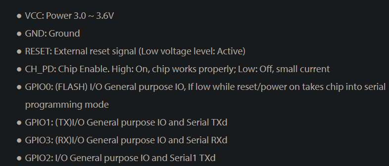
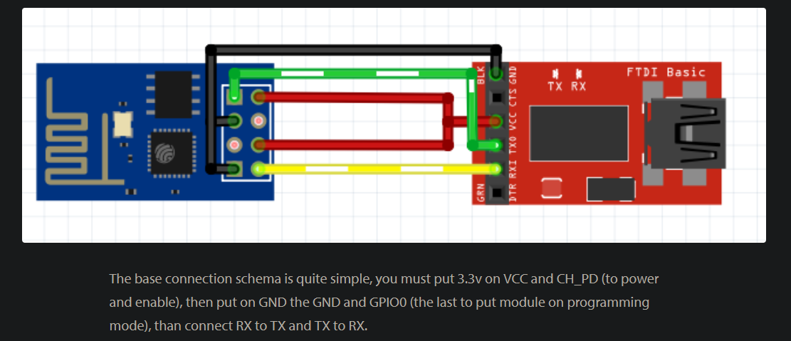
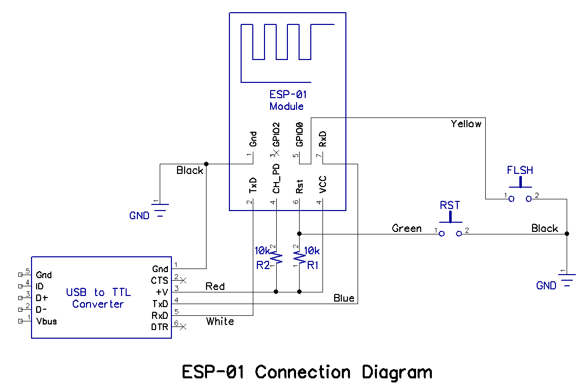

# Pin description

Note:
* GPIO0 needs to be GND on startup to enable programming.
* RST needs to be connected to high with a 10kΩ pullup resistor
* Once programming is finished, disconnect GPIO0 and connect RST to GND to reset the ESP out of programming mode.

# Circuit Diagrams

Use Fig 1 to connect the USB to TTL to the ESP module but note the RST connection in Fig 2

# USB to TTL Driver
Had to install the driver for [this device](http://hiletgo.com/ProductDetail/2157047.html) manually, found [here](https://www.silabs.com/developers/usb-to-uart-bridge-vcp-drivers), specifically the **CP210x Windows Drivers**

# Programming the ESP Module
As stated above, connect the USB/TTL to the ESP like Fig 1 but connect the RST like in Fig 2. Leave the GPIO1 pin disconnected. Connect it to the computer and start up arduino and choose generic ESP8266 from boards. Once you have the sketch upload it to the ESP. The USB/TTL should have a red LED when powered on and a bluee LED when transfering data. Once the sketch is uploaded, disconnect GPIO0 pin on ESP and touch the two GND leads on the breadboard together to simulate a RST button. This should restart the ESP into its functional state and start running the sketch. 

[ESP8266 01S Datasheet](https://www.microchip.ua/wireless/esp01.pdf)
